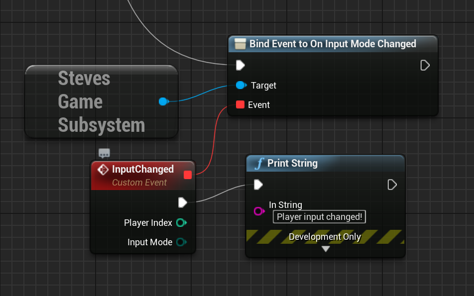

# Steve's UE Helper Plugin Library

## Introduction

This is a helper plugin library for [Unreal Engine 4](https://www.unrealengine.com) 
which makes a bunch of things better:

* UI Improvements
  * FocusableButton: button which uses Hover style to highlight when it has focus (keyboard / gamepad)
  * FocusablePanel: which ensure a widget is focussed when gamepad is activated so navigation is reliable
    * Also remembers last focussed widget so it can be restored when used in context stacks
  * FocusableUserWidget: A hack to allow UserWidgets to delegate their focus requests to a child item (required to make focus work reliably with compound widgets)
  * InputImage: Image which will change itself to an image representing a button / key based on an input action
    * (It changes dynamically when the input method changes e.g. when player moves a gamepad stick)
    * Includes use of a UiTheme data asset which maps FKeys to Sprite images of buttons
  * MenuStack/MenuBase: a context stack of widgets so you can easily create menu sequences, implement "back" navigation
  * OptionWidgetBase: a widget which implements the "choose an item" concept but adapts between mouse and keyboard/gamepad 
    style navigation depending on what the currently used input method is
* Input Improvements
  * Tracks last used input method (keyboard / mouse / gamepad) per player
  * Events raised whenever a player uses a different input method (in game, and in UI)
    (Actually reliable and not dependent on vagaries of input mappings / differences between UI and game input)

## Installing this plugin

### Cloning

The best way is to clone this repository as a submodule; that way you can contribute
pull requests if you want. The project should be placed in your project's Plugins folder.

```
> cd YourProject
> git submodule add https://github.com/sinbad/StevesUEHelpers Plugins/StevesUEHelpers
> git add ../.gitmodules
> git commit
```

Alternatively you can download the ZIP of this repo and place it in 
`YourProject/Plugins/StevesUEHelpers`.

### Referencing in C++

Edit YourProject.Build.cs and do something similar to this:

```csharp
public class YourProject : ModuleRules
{
	private string PluginsPath
	{
		get { return Path.GetFullPath( Path.Combine( ModuleDirectory, "../../Plugins/" ) ); }
	}

	public YourProject(ReadOnlyTargetRules Target) : base(Target)
	{
        // Your existing rules
        // ...


		AddStevesUEHelpers();
	}

	protected void AddStevesUEHelpers() {
		// Linker
		PrivateDependencyModuleNames.AddRange(new string[] { "StevesUEHelpers" });
		// Headers
		PublicIncludePaths.Add(Path.Combine( PluginsPath, "StevesUEHelpers", "Source", "StevesUEHelpers", "Public"));
	}

```

You can use most of the features without doing anything else, but certain features
require some additional setup, see below.

## Usage

### Widgets

Many features are contained in new widget types, which can be created directly in 
UMG Design mode. 

TODO: specific tutorials on new widget types.

### Game instance subsystem

In order to track stateful things like the current input mode for each player, 
there is a custom `GameInstanceSubsystem` called `StevesGameSubsystem`, which 
you can tap into anywhere in Blueprints by searchign for it:


Once you have access to this you can do things like tie events into the input mode
changing:



To access this in C++, just do this:

```c++
#include "StevesUEHelpers.h"

...
auto GS = GetStevesGameSubsystem(GetWorld());
if (GS)
{
    // get current mode (first player assumed)
    EInputMode CurrentInputMode = GS->GetLastInputModeUsed();
    // Subscribe to input mode changes (remember this must be a UFUNCTION)
    GS->OnInputModeChanged.AddUniqueDynamic(this, &AMyActor::OnInputModeChanged);
}
 
```

# Additional Configuration

## UiTheme

Some features of this plugin such as InputImage need a `UUiTheme` asset, which is just a Data Asset
based on the `UUiTheme` class which references other resources like button images. There is one in the Examples project as reference.

### Create a UiTheme:


1. Click Add New > Miscellaneous > Data Asset
1. Select "UiTheme" as the class
1. Save the new asset with your chosen name

### Create a Primary Asset Label

UiThemes are a new kind of primary asset, loaded at runtime. To ensure this
asset is included when packaging, create a Primary Asset Label in the same folder:

1. Click Add New > Miscellaneous > Data Asset
1. Select "Primary Asset Label" as the class
1. Name it however you like
1. Double-click to edit
1. Under "Explicit Assets", add an entry and pick the UiTheme you created above
1. Save the changes

This just ensures that the packaging system knows to include your UiTheme, since
it won't be directly referenced by any other primary asset.

### Create button sprite data

The UiTheme wants to reference DataTables which contain links between the input
keys and button sprites. So the first job is to create the button sprites.

The Example project includes some button sprites already; contained in a packed
sprite sheet. I created these using TexturePacker and imported into UE which created
the sprites, but you can create them however you like. However, we do require sprites
rather than plain textures.

This means you must have the Paper2D plugin enabled in your project.

### Linking input keys to button sprites 
Once you have a set of button sprites, you need to create DataTables which map
input FKeys (which can be keys, or mouse buttons, or gamepad buttons / sticks)
to these sprites, so that for example InputImage can be told to display the action 
"Fire", and then display either say the left mouse button or a gamepad trigger
depending on what's being used.

Personally I did this using a CSV file for ease of use, for example:

```csv
Name,Key,Sprite
Gamepad_LeftX,Gamepad_LeftX,"PaperSprite'/Game/Textures/UI/Sprites/Frames/XboxOne_Left_Stick'"
Gamepad_FaceButton_Bottom,Gamepad_FaceButton_Bottom,"PaperSprite'/Game/Textures/UI/Sprites/Frames/XboxOne_A'"
```

You should import this as a DataTable based on the KeySprite type. A separate
one is needed for keyboard / mouse and gamepad. Once you've created them, or
copied the ones from the examples, you should update the UiTheme asset you 
created to point at these data tables.

# License

The MIT License (MIT)
Copyright © 2020 Steve Streeting

Permission is hereby granted, free of charge, to any person obtaining a copy of this software and associated documentation files (the “Software”), to deal in the Software without restriction, including without limitation the rights to use, copy, modify, merge, publish, distribute, sublicense, and/or sell copies of the Software, and to permit persons to whom the Software is furnished to do so, subject to the following conditions:

The above copyright notice and this permission notice shall be included in all copies or substantial portions of the Software.

THE SOFTWARE IS PROVIDED “AS IS”, WITHOUT WARRANTY OF ANY KIND, EXPRESS OR IMPLIED, INCLUDING BUT NOT LIMITED TO THE WARRANTIES OF MERCHANTABILITY, FITNESS FOR A PARTICULAR PURPOSE AND NONINFRINGEMENT. IN NO EVENT SHALL THE AUTHORS OR COPYRIGHT HOLDERS BE LIABLE FOR ANY CLAIM, DAMAGES OR OTHER LIABILITY, WHETHER IN AN ACTION OF CONTRACT, TORT OR OTHERWISE, ARISING FROM, OUT OF OR IN CONNECTION WITH THE SOFTWARE OR THE USE OR OTHER DEALINGS IN THE SOFTWARE.