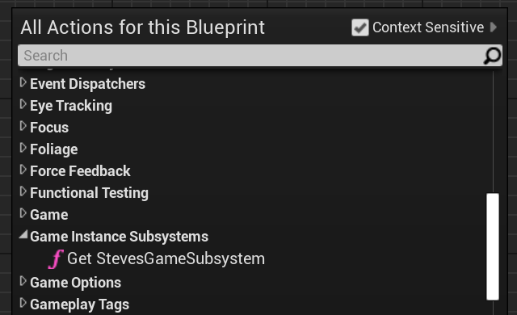
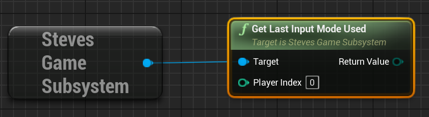

# Steve's UE Helper Plugin Library

## Introduction

This is a helper plugin library for [Unreal Engine](https://www.unrealengine.com) (version 4.26+ / 5.0+)
which makes a bunch of things better:

* [New Widgets](doc/Widgets.md)
  * Focusable buttons, menu stacks, control prompts and more
* [Input events](doc/Input.md)
  * Reliable notification when the player changes input method
* [Debug visualisation](https://www.stevestreeting.com/2021/09/14/ue4-editor-visualisation-helper/)
* [Better DataTable Row References](https://www.stevestreeting.com/2023/10/06/a-better-unreal-datatable-row-picker/)
* [Light Flicker](doc/LightFlicker.md)
* [Easing Functions](Source/StevesUEHelpers/Public/StevesEasings.h)
* [Replicated Physics Actor](Source/StevesUEHelpers/Public/StevesReplicatedPhysicsActor.h)
* [Actor Pooling System](Source/StevesUEHelpers/Public/StevesPooledActorSystem.h)
* Halton Sequence based random stream

## Examples

This project contains the master documentation for this library, but if you want
to see examples of its use, see the [Steve's UE Examples](https://github.com/sinbad/StevesUEExamples) project.


## Installing this plugin

### Cloning

The best way is to clone this repository as a submodule; that way you can contribute
pull requests if you want. The project should be placed in your project's Plugins folder.

```
> cd YourProject
> git submodule add https://github.com/sinbad/StevesUEHelpers Plugins/StevesUEHelpers
> git add ../.gitmodules
> git commit
```

Alternatively you can download the ZIP of this repo and place it in 
`YourProject/Plugins/StevesUEHelpers`.

### Referencing in C++

Edit YourProject.Build.cs and do something similar to this:

```csharp

using System.IO;
using UnrealBuildTool;

public class YourProject : ModuleRules
{
	private string PluginsPath
	{
		get { return Path.GetFullPath( Path.Combine( ModuleDirectory, "../../Plugins/" ) ); }
	}

	public YourProject(ReadOnlyTargetRules Target) : base(Target)
	{
        // Your existing rules
        // ...


		AddStevesUEHelpers();
	}

	protected void AddStevesUEHelpers() {
		// Linker
		PrivateDependencyModuleNames.AddRange(new string[] { "StevesUEHelpers" });
		// Headers
		PublicIncludePaths.Add(Path.Combine( PluginsPath, "StevesUEHelpers", "Source", "StevesUEHelpers", "Public"));
	}

```

It's also worth adding `StevesUEHelpers` to your own .uproject as a plugin reference:

```
"Plugins": [
		...
		{
			"Name": "StevesUEHelpers",
			"Enabled": true
		},
		...

```

After adding this you should right-click your .uproject file and "Generate Visual
Studio Project Files". 

You can use most of the features without doing anything else, but certain features
require some additional setup, see below.

### Configure Custom GameViewportClient

This library contains a new `UGameViewportClient` subclass called `UStevesGameViewportClientBase`,
which is used to suppress the mouse cursor in menus then using a gamepad.

Unfortunately UE4's Slate overrides the mouse pointer visibility sometimes, so
this fixes that.

To use it, simply:

1. Open Project Settings
1. Go to Engine > General Settings
1. Change Game Viewport Client Class to StevesGameViewportClientBase

### Configure UiTheme

Some features require you to configure some theme information for the UI, which 
is discussed in more detail in the [UiTheme section](./doc/UiTheme.md).

## Game instance subsystem

In order to track stateful things like the current input mode for each player, 
there is a custom `GameInstanceSubsystem` called `StevesGameSubsystem`, which 
you can tap into anywhere in Blueprints by searching for it:



Once you have access to this you can do things like get the latest input device used:



For more details, see the [Input section](doc/Input.md).

# License

The MIT License (MIT)
Copyright © 2020 Steve Streeting

Permission is hereby granted, free of charge, to any person obtaining a copy of this software and associated documentation files (the “Software”), to deal in the Software without restriction, including without limitation the rights to use, copy, modify, merge, publish, distribute, sublicense, and/or sell copies of the Software, and to permit persons to whom the Software is furnished to do so, subject to the following conditions:

The above copyright notice and this permission notice shall be included in all copies or substantial portions of the Software.

THE SOFTWARE IS PROVIDED “AS IS”, WITHOUT WARRANTY OF ANY KIND, EXPRESS OR IMPLIED, INCLUDING BUT NOT LIMITED TO THE WARRANTIES OF MERCHANTABILITY, FITNESS FOR A PARTICULAR PURPOSE AND NONINFRINGEMENT. IN NO EVENT SHALL THE AUTHORS OR COPYRIGHT HOLDERS BE LIABLE FOR ANY CLAIM, DAMAGES OR OTHER LIABILITY, WHETHER IN AN ACTION OF CONTRACT, TORT OR OTHERWISE, ARISING FROM, OUT OF OR IN CONNECTION WITH THE SOFTWARE OR THE USE OR OTHER DEALINGS IN THE SOFTWARE.

# 3rd Party Licenses

Portions of this software include code from 3rd parties:

Math routines from David Eberly, Geometric Tools, Redmond WA 98052
Copyright (c) 1998-2021
Distributed under the Boost Software License, Version 1.0.

Boost Software License - Version 1.0 - August 17th, 2003

Permission is hereby granted, free of charge, to any person or organization
obtaining a copy of the software and accompanying documentation covered by
this license (the "Software") to use, reproduce, display, distribute,
execute, and transmit the Software, and to prepare derivative works of the
Software, and to permit third-parties to whom the Software is furnished to
do so, all subject to the following:

The copyright notices in the Software and this entire statement, including
the above license grant, this restriction and the following disclaimer,
must be included in all copies of the Software, in whole or in part, and
all derivative works of the Software, unless such copies or derivative
works are solely in the form of machine-executable object code generated by
a source language processor.

THE SOFTWARE IS PROVIDED "AS IS", WITHOUT WARRANTY OF ANY KIND, EXPRESS OR
IMPLIED, INCLUDING BUT NOT LIMITED TO THE WARRANTIES OF MERCHANTABILITY,
FITNESS FOR A PARTICULAR PURPOSE, TITLE AND NON-INFRINGEMENT. IN NO EVENT
SHALL THE COPYRIGHT HOLDERS OR ANYONE DISTRIBUTING THE SOFTWARE BE LIABLE
FOR ANY DAMAGES OR OTHER LIABILITY, WHETHER IN CONTRACT, TORT OR OTHERWISE,
ARISING FROM, OUT OF OR IN CONNECTION WITH THE SOFTWARE OR THE USE OR OTHER
DEALINGS IN THE SOFTWARE.
