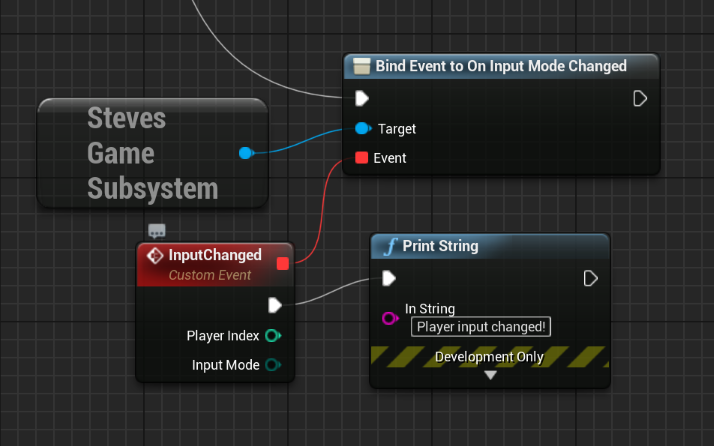

# Input Helpers

Unreal lacks an in-built way to determine the currently used input method by
a player, and ways to be notified when that changes. So I fixed that 😄

All these functions are available on "Steves Game Subsystem", which you can 
get on a Blueprint like this:


Or in C++ like this:

```c++
#include "StevesUEHelpers.h"

...
auto GS = GetStevesGameSubsystem(GetWorld());
```


## Getting the last input device for a player

Blueprint:


C++:

```c++
EInputMode Mode = GS->GetLastInputModeUsed(PlayerIndex);
```

## Listening for when player changes input device

Blueprint:



C++:

```c++
// Subscribe somewhere in your code
void AYourClass::ListenForInputModeChanges()
{
    auto GS = GetStevesGameSubsystem(GetWorld());
    GS->OnInputModeChanged.AddDynamic(this, &AYourClass::InputModeChanged);
}
```

```c++
// This is your method which gets called
void AYourClass::InputModeChanged(int PlayerIndex, EInputMode NewMode)
{
    ...
}
```
