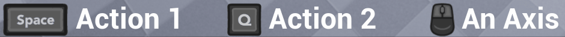

# InputImage

InputImage is a subclass of Image which can be told to display an image of 
a keyboard key, mouse button, gamepad stick / button, etc. It can also look
up the key currently assigned as input for an associated Action or Axis, changing
dynamically based on what the current input method is (mouse, keyboard, gamepad).

Here's an example of the icons changing as the player moves a gamepad stick or 
touches keyboard/mouse:

InputImage requires a [UiTheme](UiTheme.md) to operate, which links to the images it needs.

## Properties

### Binding Type

* "Enhanced Input Action" to specify an [Enhanced Input](https://docs.unrealengine.com/5.1/en-US/enhanced-input-in-unreal-engine/) action
* "Action" if the image should display the current mapping for a legacy input action
* "Axis" to look up a legacy input axis
* "Key" to manually specify a key (which can be gamepad or mouse too)

### Enhanced Input Action

Pick an Enhanced Input action from the asset browser interface.

> Note: at the time of writing, **Enhanced Input** exposes *no* events for us to
> be notified of mapping changes. Therefore, if you have persistent UI up which
> might be affected by a mapping change, you must call 
> `UStevesGameSubsystem::NotifyEnhancedInputMappingsChanged()` after you have
> made changes to mappings. You don't have to do it the first time if you add 
> mappings in `BeginPlay`.

### Action or Axis Name

The name of the input action or axis that should be looked up to determine the
key that we'll need an image for.

You can leave this blank if you set Binding Type to "Key".

### Device Preference

When using an Action or Axis Name, which device to prefer to show the image for
where there are multiple mappings. The default is "Auto", which means:

1. Gamepad, if the last used device was gamepad
2. If an Action (button/key), prefer Keyboard over Mouse buttons
3. If an Axis, prefer Mouse over Keyboard

### Key

If you don't want the InputImage to look up an action, but want to manually specify
an input action, then drop down this list and pick a key (which can be a gamepad
button, mouse axis etc as well as a keybaord key) and the InputImage will display
that.

### Custom Theme

This is an optional link to a [UiTheme](UiTheme.md) you want to use for this
InputImage. If blank, the default UiTheme is used.

## See Also

 * [Rich Text Input Decorator](RichTextInputDecorator.md)