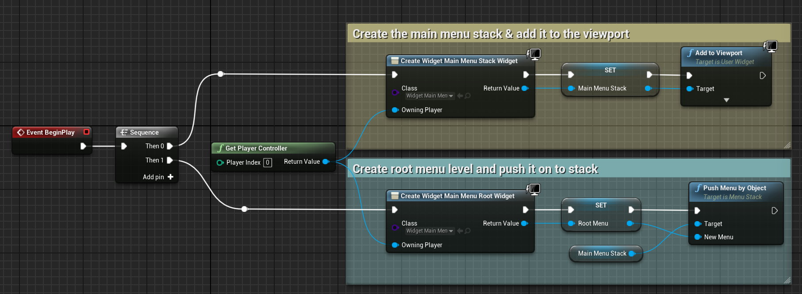
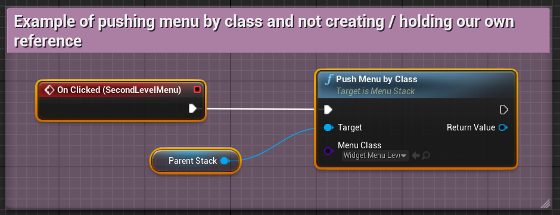
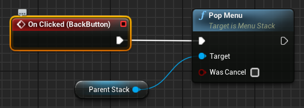

# Menus

There are 2 main classes to help you create menu systems: MenuBase and MenuStack.
MenuStack keeps a stack of menus where the top item on the stack has the focus, and
going "back" pops that off the top and returns focus to the previous menu.
Fairly standard hierarchical menus.

The [Examples Project](https://github.com/sinbad/StevesUEExamples) includes a
functioning menu you can look over to see how it's done, and/or you can follow
these steps.

## GameViewportClient customisations

To get full functionality we need to use a custom viewport client, see 
[Configuring A Custom GameViewportClient](../ReadMe.md/#configure-custom-gameviewportclient)

## Creating the MenuStack

The MenuStack class is best used as a dual purpose: keeping track of the stack 
of individual menus, and also being the container for them.

### 1. Create the Blueprint

Start by creating a new Widget Blueprint.

1. Right-click in Content browser
1. Select User Interface
1. Select Widget Blueprint
1. Give it a name, like "Widget_MainMenuStack"

### 2. Reparent to MenuStack

We need our widget to be subclassed from MenuStack to gain its power.

1. Open the File Menu
2. Select Reparent Blueprint
3. Search for MenuStack and select it

### 3. Create a Container for the Menus

The menus need to live somewhere inside this widget. You can lay out this
widget however you like, but somewhere there needs to be a Named Slot which is
where your menus will live when they're displayed.

You can use any layout you like; in the [examples project](https://github.com/sinbad/StevesUEExamples) I've just centred the Named Slot and made it fit its content, 
meaning we have complete flexibility on how we size our menus.

1. In the Palette, search for Named Slot
1. Place this Named Slot wherever you want the menus to appear in your layout
1. Give the Named Slot a useful name, e.g. MenuContainer
1. Select the root of your widget and look at the Details panel
1. Set the "Menu Container" property to the Named Slot you just created
1. Compile your widget

That's it, your MenuStack is ready to go. 

## Creating a Menu

Now you need a menu to go in your stack. Let's create a basic main menu.

### 1. Create the Blueprint

Start by creating a new Widget Blueprint.

1. Right-click in Content browser
1. Select User Interface
1. Select Widget Blueprint
1. Give it a name, like "Widget_MainMenuRoot"

### 2. Reparent to MenuBase

The MenuBase class gives us a bunch of nice convenience functionality, as well
as being able to become part of a MenuStack. So our widget needs to be one of those.

1. Open the File Menu
2. Select Reparent Blueprint
3. Search for MenuBase and select it

### 3. Create the Menu Buttons

This library comes with a custom button which is perfect for menus, called
[FocusableButton](FocusableWidgets.md). It has the advantage of automatically highlighting when
focussed (e.g. gamepad or keyboard navigation). 

1. Change the view mode (top-right) from Fill Screen to Desired
    * This is because we're fitting inside the container so will only take the space we need
1. Right-click the Canvas Panel and Replace With > Vertical Box
    * We're only going to use a simple vertical menu for this demo
1. Drag a Focusable Button from the Palette into the vertical Box
1. Style it however you want
    * In particular, pay attention to the Style entries
    * The Hovered style will be used for the keyboard/gamepad selected state as well
1. Add a child text widget
1. Duplicate the button to fill out your menu

Obviously you can assign click events to each of those buttons to do whatever
you want - which could be to launch sub-menus. But first, let's see how to 
actually get these menus on screen.

### 4. Set the default focus button

In this case we want *some* menu button to have the focus as soon as the
menu opens, because it's a main menu.

1. Click on the root of your widget
1. In Details, find Focusable Panel > Initial Focus Widget Name
1. Type or copy/paste the name of the widget which should have focus on start

### 5. (Optional) Set input mode, pause etc

Each MenuBase can do some common things for you, like changing the input mode,
pausing the game, or showing / hiding the pointer.

1. Click on the root of your widget
1. In Details, find the Behavior section
1. Set "Input Mode Setting" to something other than No Change if you want it to set the input mode
1. Do the same for Mouse Pointer Visibility or Game Pause Setting

## Showing a Menu

To show a menu, you need to do 2 things:

1. Create the MenuStack and add it to the viewport
1. Create the MenuBase and add it to the stack (this adds it as a child, in the MenuContainer)

Here's an example of doing that in Blueprints:

## Adding a Submenu Level

To progress to a deeper level in the menu, you just push another instance on
to the same stack exactly as you did with the first. 

You can also push a menu by class instead of manually creating the instance
yourself:

The default behaviour is that the existing top of stack
is hidden (but not destroyed, so it keeps its state). You can change that
by unchecking the "Hide when Superceded" option on a MenuBase level. Then, the
menu will continue to be visible.

## Backing up

To go back a level in the menu, call PopMenu on the stack. Doing this from
inside the sub-level is very easy, since every MenuBase has a reference to its
parent stack:

The "Was Cancel" argument is to tell anything waiting on that menu level whether
the action that closed the menu level should be considered "OK" or "Cancel";
not everything needs this.

## Close Notifications

You can listen to a menu level having been closed by binding to the OnClose
event. That has the "Was Cancel" boolean in case you need to differentiate
between OK/Cancel. 

Menu levels are garbage collected so if you keep a reference to them then you'll
always have access to their state regardless of whether they're active in the
stack right now. So if you need to process some changes in a submenu you can 
just keep a reference to it and on close, process its contents.

