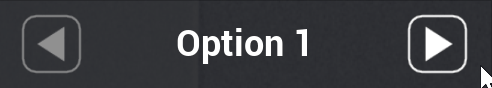
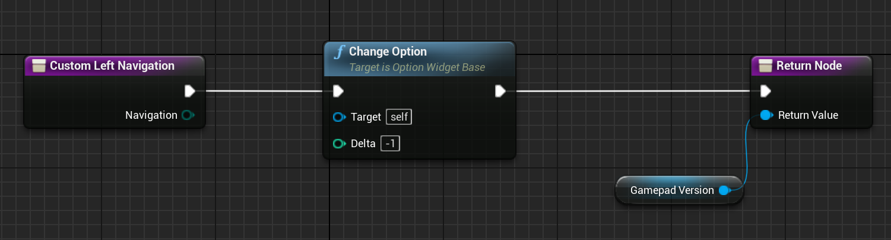

# Option Widget (OptionWidgetBase)

The point of this widget is to provide a convenient way to create option selectors
in your UI that are compatible with both mouse pointer and gamepad use:

The widget automatically switches between modes as the player changes input device.
The screenshot above is from the [Example project](https://github.com/sinbad/StevesUEExamples).

## Creating a subclass

`OptionWidgetBase` only provides the base functionality with no visual element,
you need to create a Widget Blueprint derived from it to use it.

1. Create a Widget Blueprint in your project
1. Re-parent it to `OptionWidgetBase`

You should create this blueprint solely for your option widget, and then use
this widget in other widget blueprints when you want an instance of it.

Since this widget is designed to fit inside other widgets, it's a good idea to
change the sizing mode in the top-right to Custom, and set it to something
representative for this widget e.g. 300x60.

## Linking the visual elements

`OptionWidgetBase` works by assuming a certain visual elements are present, which 
it binds to by name, and which you *must* define in your Blueprint. 

Element Name|Usage
:------------|:-----
MouseVersion|The container for all elements which will be shown when the mouse is active. This is probably a panel.
MouseDownButton|The button which will decrement the selection index in mouse mode
MouseUpButton|The button which will increment the selection index in mouse mode
MouseDownImage|The image displayed inside the button for decrementing the selection index in mouse mode
MouseUpImage|The image displayed inside the button for incrementing the selection index in mouse mode
MouseText|The text widget which displays the selected item in mouse mode
GamepadVersion|The container for all elements which will be shown when a gamepad is active (or keyboard navigation). This is almost certainly a [FocusableButton](FocusableWidgets.md) so it can hold focus.
GamepadDownImage|The image displayed when decrementing the selection index in gamepad mode is allowed
GamepadUpImage|The image displayed when incrementing the selection index in gamepad mode is allowed
GamepadText|The text widget which displays the selected item in gamepad mode

An example of how to create a conforming visual widget can be found in the
[Example project](https://github.com/sinbad/StevesUEExamples), under the Blueprints/UI/Components
folder. This one is a horizontal option widget but you can make any layout you want.

## Supporting gamepad / keyboard navigation

There's one more thing to do; `OptionWidgetBase` knows how to change the 
selected item when the mouse up/down buttons are clicked, but it doesn't know which
direction on the gamepad is supposed to do what. In the [Example project](https://github.com/sinbad/StevesUEExamples)
we use left/right but you might want up/down for your widget.

To implement this:

1. Select the button you're using for GamepadVersion
1. In Details > Navigation, find the 2 directions you want to use to increment/decrement on the gamepad
1. Change the decrement direction to "Custom" then "Create Function"
1. Define the function like this:

Repeat this for the increment direction, but change the "Delta" on the Change Option
call to 1 instead of -1.

# Using your new option widget

You create instances of your new option widget subclass in whatever larger
widget panel you want to include it in.

## Populating Options

You can either:

1. Populate the list at design time
    1. See the Content section in details for an instantiated option widget
1. Call SetOptions to change the list at runtime

## Option Changed Event

`OptionWidgetBase` raises an Option Changed event whenever the player changes
the selected option, so you can listen to that if you want to have dynamic
reactions to it.