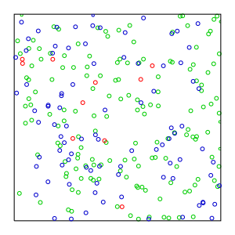
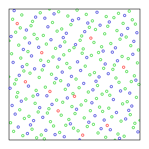

# Randomisation Helpers

## Halton Sequence Random Stream

[Halton Sequences](https://en.wikipedia.org/wiki/Halton_sequence) are very useful random number sequences which have a nicer distribution - both more balanced than 
generic Rand() but also quite organic looking. 

Generic pseudorandom 2D sequence:

Halton Sequence:

(Both images credit: Wikipedia)

You'll find an implementation of this in the [`FStevesBalancedRandomStream`](../Source/StevesUEHelpers/Public/StevesBalancedRandomStream.h) class, which is left open for other random
algorithms but currently only supports Halton Sequences. 

## Shuffle Bags

Shuffle bags are a useful way of generating random items without duplication until the "bag" is empty and subsequently
refilled. Probabilities can be tweaked by adding more of a given item to the "bag". It's very good at simulating
packs of cards, bags of tokens etc that you see in card games and table top games. 

See [`FStevesShuffleBag`](../Source/StevesUEHelpers/Public/StevesShuffleBag.h) for details. 