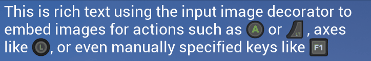
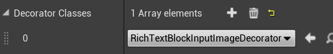

# Rich Text Input Image Decorator

This helper class allows you to embed images of input controls into rich text
like this:

The UMG [Rich Text widget](https://docs.unrealengine.com/en-US/Engine/UMG/UserGuide/UMGRichTextBlock/index.html)
has two main configuration points.The first is the Text Style Set which controls the font
(mandatory: if you don't set up one of these with a Default style your text will be garbage).

The second, which is what we're interested in here, is the decorator system.
This allows you to use custom markup to insert other widgets in the rich text run.

## Setup

### Create theme

If you haven't done this already, you need to create a [UiTheme](UiTheme.md).
Follow the instructions in that linked page first; the Rich Text blocks always
use the default theme (unfortunately I haven't found a way of exposing
extra properties on decorators in the editor to allow a custom theme).

### Add decorator to Rich Text block

All you need to do next is add "RichTextInputImageDecorator" to the list of decorators
on your Rich Text block instance:

Then you can use the `<input ... />` tag whenever you want to insert an image
related to input controls. There are various options:

## Adding input images to rich text

### Enhanced Input Actions

`<input eaction="IA_MyAction"/>`

This displays the image for a bound Enhanced Input action. The name of the action
should match the action name, which is relative to one of the directories
you specify in Project Settings > Plugins > StevesUEHelpers.

### Legacy Input Actions

`<input action="TheActionName"/>`

This displays the image for a bound action input, as configured in project settings.

### Legacy Input Axes

`<input axis="TheAxisName"/>`

Similarly this displays the image for a bound axis input, as configured in project settings.

### Manual Key

If you don't want to reference the input bindings and just want to display a
single key (and in this case 'key' can mean an actual keyboard key, or a gamepad
button, or any axis).

`<input key="F1"/>`

The value of the "key" attribute can be any string present in the 
[EKeys enum](https://docs.unrealengine.com/en-US/API/Runtime/InputCore/EKeys/index.html).
That's not just keyboard keys, it's gamepad and mouse buttons & axes too.

## Optional Parameters

### Player

For the `action` and `axis` types, the default is to use the binding for the
first player. If you have multiple local players you can add the attribute `player="n"` where
n is 0 for the first player, 1 for the second etc.

E.g. `<input action="Fire" player="1"/>` would display an image for the Fire input
action bound for the second player.

### Width / Height

By default the size of the images is based on the line height of the font and the
aspect ratio of the image. However, if you want to override this, you 
can add `width="w"` and/or `height="h"` attributes, where w/h are size 
units.

E.g. `<input action="Fire" height="75"/>` will force the height to 75 units and
derive the width from that based on the aspect ratio.

It's generally best just to set the height and not the width as well, since 
setting both can cause the image to be distorted if it's not the same aspect ratio.

### Device Preference

For the `action` and `axis` types, which device to prefer to show the image for
can be specified with the `prefer="x"` attribute. The default is `prefer="auto"`, which means:

1. Gamepad, if the last used device was gamepad
2. If an Action (button/key), prefer Keyboard over Mouse buttons
3. If an Axis, prefer Mouse over Keyboard

Alternatives are:

* `prefer="gkm"`: prefer Gamepad, then Keyboard, then Mouse
* `prefer="gmk"`: prefer Gamepad, then Mouse, then Keyboard
* `prefer="gmkbutton"`: prefer Gamepad, then whichever of Mouse or Keyboard last had a button pressed
* `prefer="gmkaxis"`: prefer Gamepad, then whichever of Mouse or Keyboard last had an axis moved

## See Also

 * [Input Image](InputImage.md)